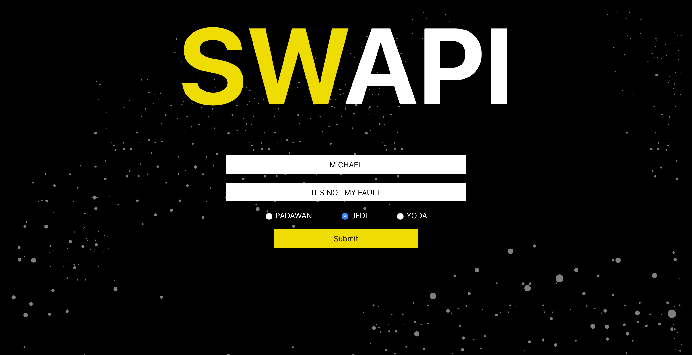
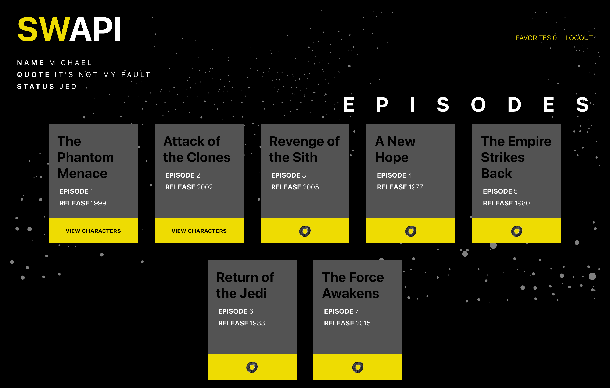
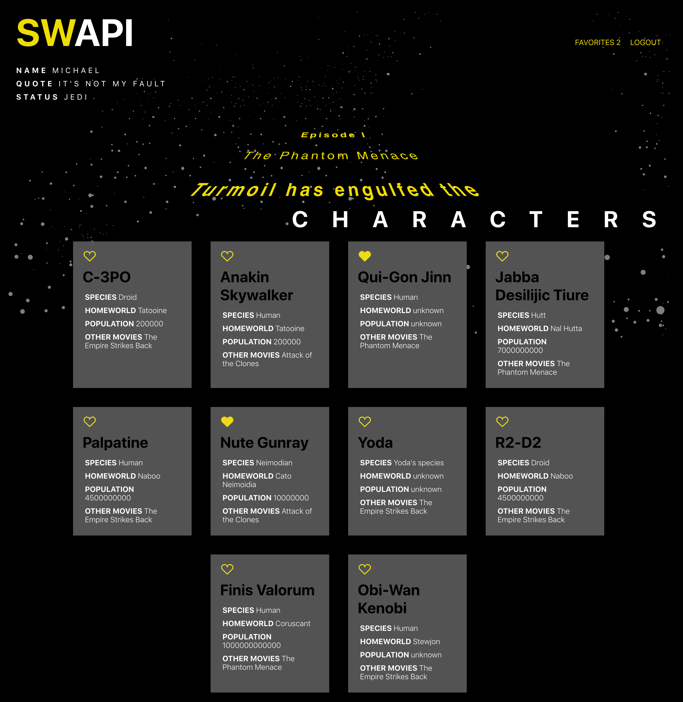
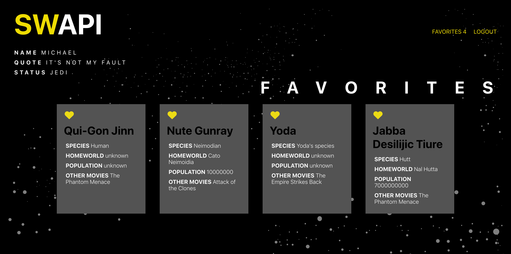

# Star Wars API

## by: Michael Schneider and Quinne Farenwald
[Michael Schneider](https://github.com/mschneider247)
[Quinne Farenwald](https://github.com/qfarenwald)

### Summary:
SWAPI is a React App based around the Star Wars API that displays different categories of star wars data, starting with movies, then diving deeper into 10 characters for that movie. Users are able to favorite their favorite characters and view them on a favorites page.

### Tech Stack:
React, ES6, Fetch, Promises, Routes, propTypes, Jest/Enzyme

### Installation:
Check out the live site here: 
Otherwise, clone down this repo.  Then in your terminal run npm install followed by npm run.  Then visit localhost 3000 in your browser!

### Screenshots
Homepage/User Form: User must input name, quote, and select a level before they can submit the form.

Movies Page that user sees after logging in: As movie data loads 'VIEW CHARACTERS' button become available.

Characters Page user sees after clicking 'VIEW CHARACTERS': The crawl text for the movie will scroll upward as user reviews the character data and favorites characters by clicking on the heart.

Favorites Page that user sees after clicking 'FAVORITES' at the top right of the screen: Characters can be unfavored and favored and will be simultaneously added and removed visually from this page.

### Testing Screenshots:
